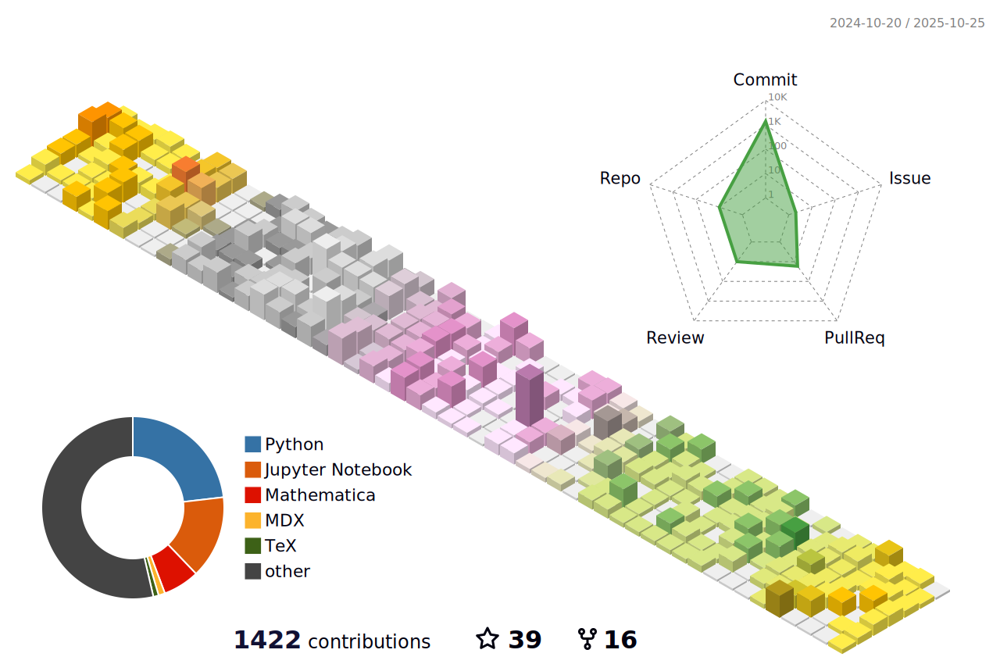

[VisualDust](https://www.gong.host) aka `Gavin Gong` (｡•̀ᴗ-)✧.   

I've been written code for [](https://wakatime.com/@b93a26b6-8ea1-44ef-99ed-bcb6e2c732f1)  

I'm a:  
- 1st year PhD student at NCSU CSC department.
- Half stack developer.
- Arch Linux user.
- Skilled `Python` speaker.
- Poor `CUDA`, `C++`, `C#`, `Java/Kotlin`, `TypeScripts` speaker.
- Pytorch, Dotnet, React user.
- Surviving against Privacy-preserving AI computing, Large Language Model, Computer Vision things.

```
┌───┬───┬───┬───┬───┬───┬───┬───┬───┬───┬───┬───┬───┬───────┐ ┌───┬───┬───┐ ┌───┬───┬───┬───┐
│~ `│! 1│@ 2│# 3│$ 4│% 5│^ 6│& 7│* 8│( 9│) 0│_ -│+ =│ BacSp │ │Ins│Hom│PUp│ │N L│ / │ * │ - │
├───┴─┬─┴─┬─┴─┬─┴─┬─┴─┬─┴─┬─┴─┬─┴─┬─┴─┬─┴─┬─┴─┬─┴─┬─┴─┬─────┤ ├───┼───┼───┤ ├───┼───┼───┼───┤
│ Tab │ Q │ W │ E │ R │ T │ Y │ U │ I │ O │ P │{ [│} ]│ | \ │ │Del│End│PDn│ │ 7 │ 8 │ 9 │   │
├─────┴┬──┴┬──┴┬──┴┬──┴┬──┴┬──┴┬──┴┬──┴┬──┴┬──┴┬──┴┬──┴─────┤ └───┴───┴───┘ ├───┼───┼───┤ + │
│ Caps │ A │ S │ D │ F │ G │ H │ J │ K │ L │: ;│" '│ Enter  │               │ 4 │ 5 │ 6 │   │
├──────┴─┬─┴─┬─┴─┬─┴─┬─┴─┬─┴─┬─┴─┬─┴─┬─┴─┬─┴─┬─┴─┬─┴────────┤     ┌───┐     ├───┼───┼───┼───┤
│ Shift  │ Z │ X │ C │ V │ B │ N │ M │< ,│> .│? /│  Shift   │     │ ↑ │     │ 1 │ 2 │ 3 │   │
├─────┬──┴─┬─┴──┬┴───┴───┴───┴───┴───┴──┬┴───┼───┴┬────┬────┤ ┌───┼───┼───┐ ├───┴───┼───┤ E││
│ Ctrl│    │Alt │      VisualDust       │ Alt│ Fn │    │Ctrl│ │ ← │ ↓ │ → │ │   0   │ . │←─┘│
└─────┘    └────┴───────────────────────┴────┴────┘    └────┘ └───┴───┴───┘ └───────┴───┴───┘
```


